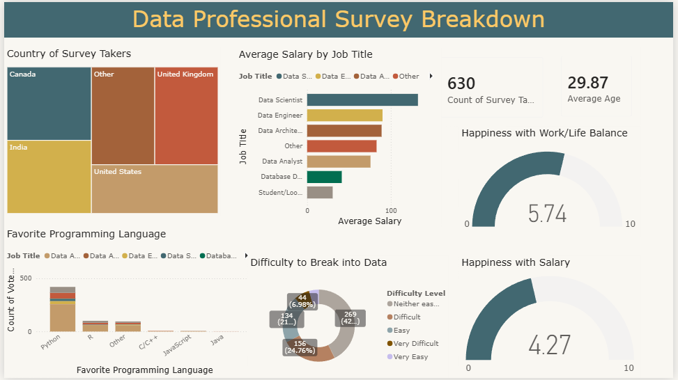

# Data Professional Survey Analysis — Power BI

An interactive Power BI dashboard analyzing survey responses from data professionals to understand their demographics, salaries, programming language preferences, career challenges, and overall job satisfaction.

## 📊 Project Overview

This project analyzes survey data from professionals working in the data industry.

The dashboard provides an overview of:
- Survey participant demographics
- Average salary by job title
- Programming language preferences
- Difficulty of entering the data industry
- Work-life balance satisfaction
- Salary satisfaction
- Geographic distribution of survey respondents

The goal is to transform survey responses into an interactive dashboard that makes workforce and career trends easier to explore.

## 🎯 Objectives

The dashboard was designed to answer questions such as:
- Where are the survey respondents located?
- What is the average salary across different data-related job roles?
- Which programming languages are most popular among data professionals?
- How difficult do professionals find entering the data industry?
- How satisfied are professionals with their work-life balance?
- How satisfied are professionals with their salaries?
- What does the overall demographic profile of the respondents look like?

## 🛠️ Tool
- **Microsoft Power BI**

## 📈 Dashboard Overview



The dashboard provides a consolidated view of survey responses using interactive visualizations and KPI cards.

### Key Metrics

The dashboard currently represents **630 survey respondents** with an average respondent age of approximately **29.87 years**.

| Metric | Value |
|---|---:|
| Survey Respondents | 630 |
| Average Age | 29.87 |
| Work-Life Balance Happiness | 5.74 / 10 |
| Salary Happiness | 4.27 / 10 |

## 🔍 Dashboard Analysis

### 🌎 Country Distribution

The dashboard shows the geographic distribution of survey participants across countries including:

- Canada
- India
- United Kingdom
- United States
- Other

This provides context for interpreting salary, career, and satisfaction patterns across the surveyed population.

### 💼 Average Salary by Job Title

The dashboard compares average salary across several data-related roles, including:

- Data Scientist
- Data Engineer
- Data Architect
- Data Analyst
- Database Developer
- Other roles
- Student / Learner

The visualization makes it possible to compare compensation patterns across different career paths within the data industry.

### 💻 Programming Language Preferences

The dashboard analyzes respondents' preferred programming languages.

The visual includes languages such as:

- Python
- R
- Other
- C/C++
- JavaScript
- Java

**Python is the most prominent programming language among the surveyed respondents**, based on the dashboard's response distribution.

### 🚪 Difficulty Breaking into Data

The dashboard examines how respondents perceive the difficulty of entering the data industry.

Responses are grouped into categories including:

- Very Easy
- Easy
- Neither easy nor difficult
- Difficult
- Very Difficult

This provides insight into the perceived accessibility of careers in the data field.

### ⚖️ Work-Life Balance

Respondents' happiness with their work-life balance is represented on a 0–10 scale.

**Average Work-Life Balance Happiness: 5.74 / 10**

### 💰 Salary Satisfaction

The dashboard also measures respondents' satisfaction with their salaries.

**Average Salary Happiness: 4.27 / 10**

The lower salary satisfaction score compared with the work-life balance score provides an interesting perspective on how respondents perceive different aspects of their professional experience.

## 💡 Key Insights

Based on the dashboard:

- The survey contains **630 respondents** with an average age of **29.87 years**.
- **Python is the dominant preferred programming language** among respondents.
- **Data Scientist** is the highest-paying role among the displayed job titles.
- Respondents report an average **work-life balance satisfaction of 5.74/10**.
- Average **salary satisfaction is 4.27/10**, lower than work-life balance satisfaction.
- The dashboard shows a substantial portion of respondents consider breaking into the data industry to be difficult, highlighting the perceived challenges of entering the field.

## 📌 Dashboard Features

- KPI cards
- Geographic analysis
- Salary comparison by job title
- Programming language analysis
- Career difficulty analysis
- Work-life balance analysis
- Salary satisfaction analysis
- Interactive Power BI visualizations
- Survey-based exploratory analysis


## 📁 Repository Structure

```text
DataProfessionalSurvey/
│
├── screenshots/
│   └── overview.png
│
├── DataProfessionalSurvey.pbix
│
└── README.md
